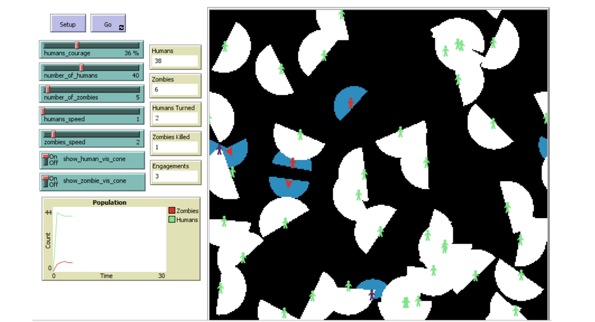

<!-- ABOUT THE PROJECT -->
## Zombie Apocalypse

I created an agent-based modelling simulation on NetLogo.

If you would like to know more about the project, please check out my
[blog post](https://erolgelbul.com/project-blog/zombie-apocalypse-ai), where I talk about:
* Randomness
* Reasons for initial variables
  * Courage of Humans
  * Number of Agents
  * Speed of Agents
* Simulations
* Conclusion

(<a href="#top">back to top</a>)

<!-- GETTING STARTED -->
## Getting Started

You will need NetLogo to run this program. The most recent version of NetLogo can be downloaded [here](https://ccl.northwestern.edu/netlogo/download.shtml).

After you have NetLogo installed, fork the project files. Follow:

1. Launch NetLogo.
2. Click on `File`, then `Open`.
3. Select `Apocalypse_Project.nlgo`.
4. Click on `Setup`.
5. Read the modifiers and experiment.
6. Change the speed of the simulation using the slider above.
7. Press `Go` and run the simulation.

(<a href="#top">back to top</a>)

<!-- CONTRIBUTING -->
## Contributing

If you would like to add any extra features to the Logisim simulation, feel free to fork and create a pull request. Thank you!

1. Fork the Project
2. Create your Feature Branch (`git checkout -b feature/AmazingFeature`)
3. Commit your Changes (`git commit -m 'Add some AmazingFeature'`)
4. Push to the Branch (`git push origin feature/AmazingFeature`)
5. Open a Pull Request

(<a href="#top">back to top</a>)

<!-- CONTACT -->
## Contact

Erol Gelbul - [Website](erolgelbul.com) - erolgelbul@gmail.com

Project Link: [Zombie Apocalypse Simulation](https://github.com/ErolGelbul/zombie-apocalypse-ai)

(<a href="#top">back to top</a>)

<!-- MARKDOWN LINKS & IMAGES -->
